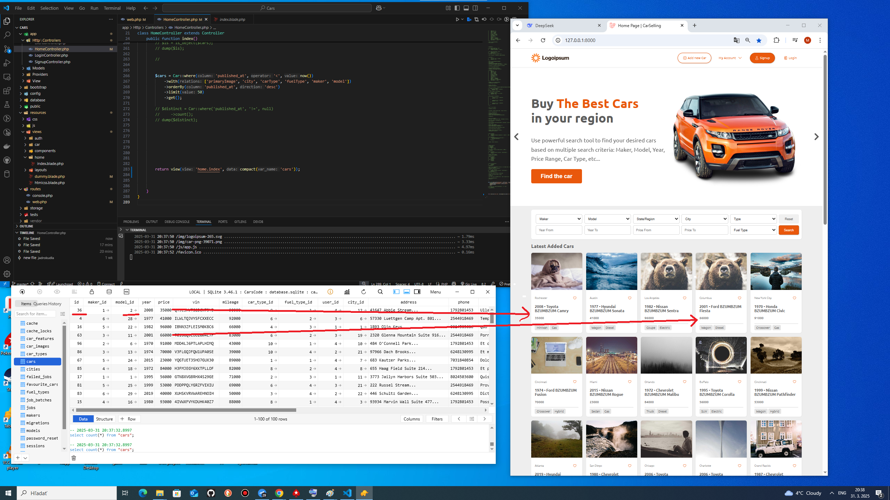
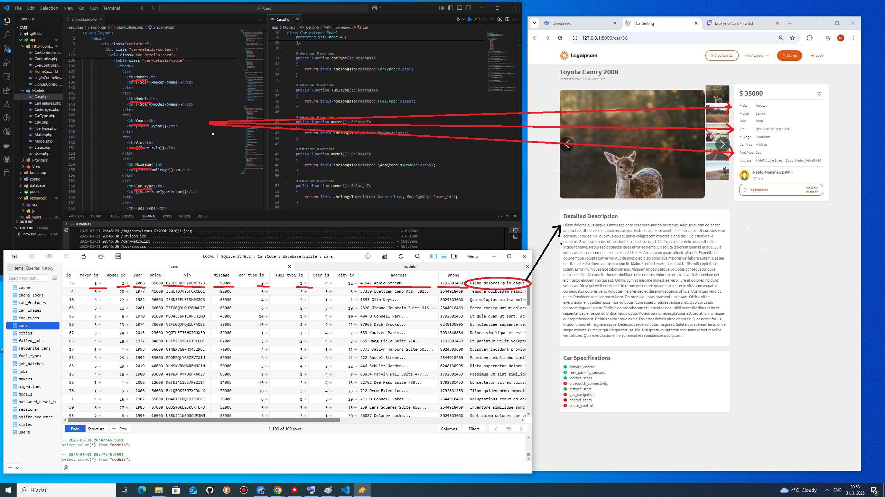
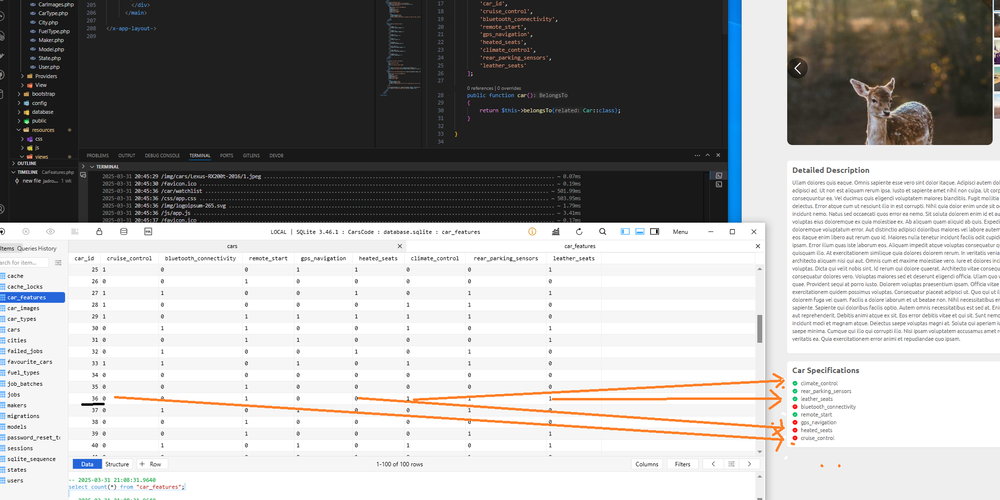
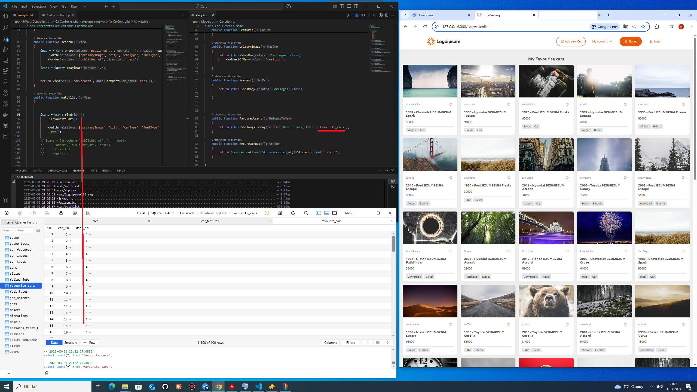

## 📸 Screenshots
<h2>MVC Car market, SQlite DB, relationship between models. Pictures are random generated from factory. </h2>
<h3>1. Published cars</h3>

<h3>2. Car model with properties</h3>

<h3>3. Car features (boolean)</h3>

<h3>3. Favourite cars, user id:4</h3>

